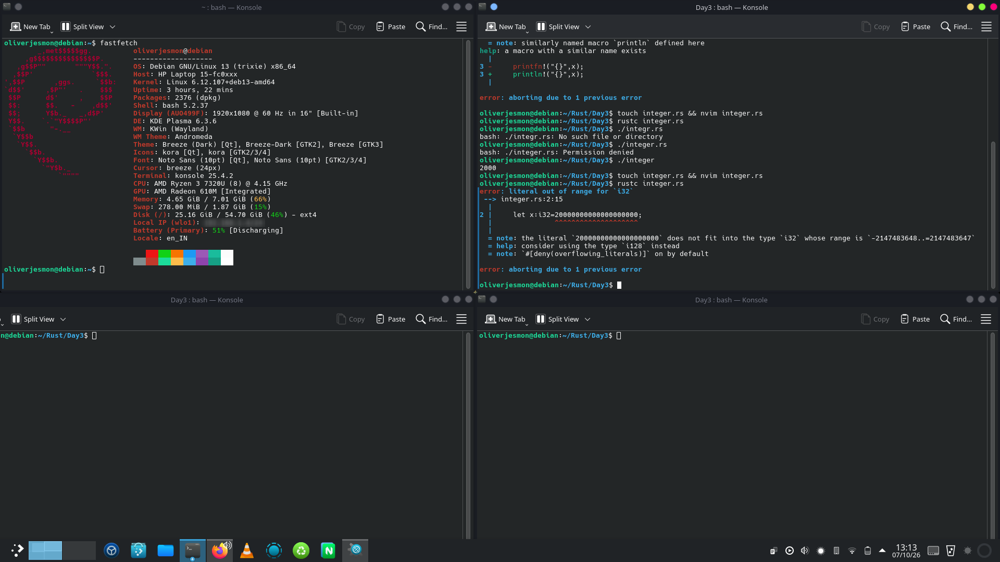
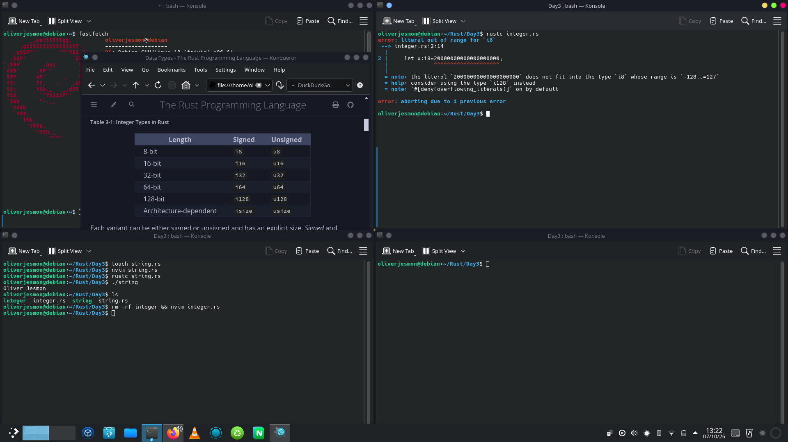
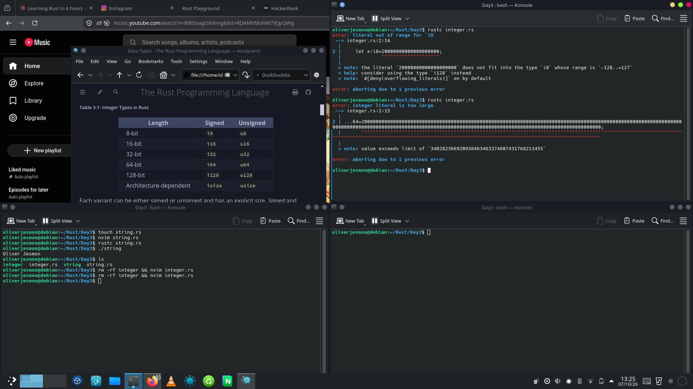
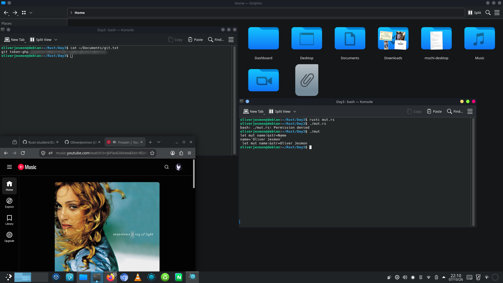

<h1>Day 3 of my Rust Programming Journey</h1>

07/10/2026 Today I learn't about data types (let[keyword] variable_name:Datatype) such as i8 which is unsigned integer can store whole number ranging from -128 to 128. Similarly i32,i64,i128 and it can be i(architecture type)

  

  

  
<h2>Most Important thing ⚠️ : Variables in Rust Are By Default IMMUTABLE(not be overwritten unless explicitly declared)</h2>

The variables in the Rust are immutable by nature which means their value cannot be changed once they're declared. UNLESS, you use 'mut' keyword

<code>let mut name:&str="name" 
name="Oliver Jesmon" 
println!("{}",name)
</code>
  

