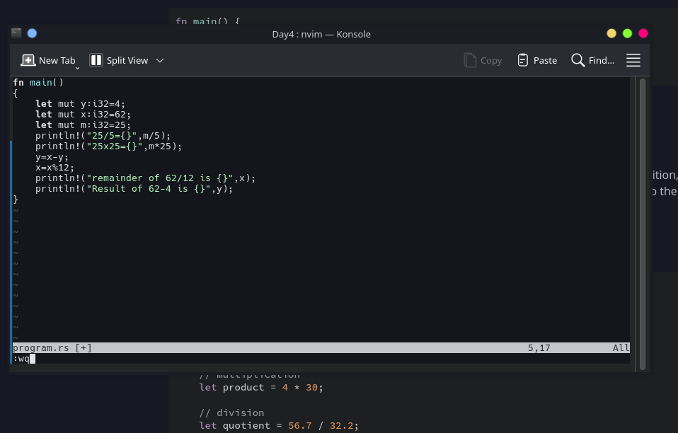
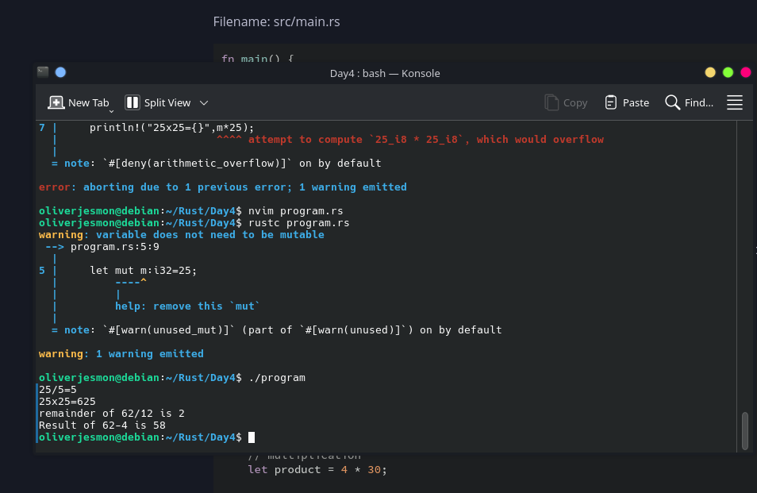

<h1>Day4 of My Rust Programming</h1>

08/10/2026 This is my day 4 of learning and these are the things I covered:

<ul>
<li>Arithmetic operations</li>
<li>Pre calculated or the compiler heuristically back tracks the output before the program get's executed(scroll down to image 2).</li>
<li>Assingment operators such as <code>/=,+=,-=,*=,%=(for remainder)</code></li>
</ul>
  

